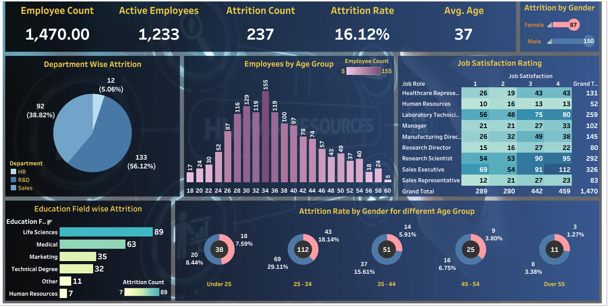

# HR Attrition Analysis Report

## Objective

The objective of this project is to analyze employee attrition patterns and identify the key factors contributing to employee turnover across the organization. The insights from this analysis can help HR and management teams improve retention strategies and workforce planning.

## Dashboard Preview

*Interactive HR attrition dashboard created using Tableau.*

## Dataset Overview

The dataset includes employee demographic and job-related information such as department, job role, education background, age, gender, and job satisfaction ratings. It provides a comprehensive view of the workforce and attrition behavior.

## Key Workforce Metrics

* Total Employees: 1,470
* Active Employees: 1,233
* Attrition Count: 237
* Overall Attrition Rate: 16.12 percent
* Average Employee Age: 37 years

## Department-wise Attrition Analysis

The Sales department shows the highest attrition, contributing to more than half of the total employee exits. Research and Development experiences moderate attrition levels, while the Human Resources department has the lowest attrition, indicating stronger employee retention.

## Age Group Analysis

The majority of employees belong to the 25 to 34 age group. This group also records the highest attrition, suggesting higher job mobility among early-career professionals. Attrition decreases as age increases, and employees above 45 years demonstrate relatively stable retention.

## Gender-wise Attrition Analysis

Male employees account for a higher portion of attrition compared to female employees. This pattern is consistent across most age groups, particularly between 25 and 44 years.

## Education Field-wise Attrition

Employees with Life Sciences and Medical educational backgrounds show higher attrition counts. Marketing and Technical Degree holders experience moderate attrition, while Human Resources and other education fields show minimal attrition.

## Job Satisfaction Analysis

Higher attrition is observed among employees with lower job satisfaction ratings. Job roles such as Sales Executive and Laboratory Technician have larger employee populations and varied satisfaction levels, contributing significantly to overall attrition.

## Key Insights

* Sales and R&D departments require focused retention strategies
* Employees aged 25 to 34 are at higher risk of attrition
* Improving job satisfaction can help reduce employee turnover
* Targeted engagement programs based on job role and education background may improve retention

## Tools Used

* Power BI for dashboard creation and visualization
* SQL for data querying and analysis
* Python for data cleaning and exploratory analysis

